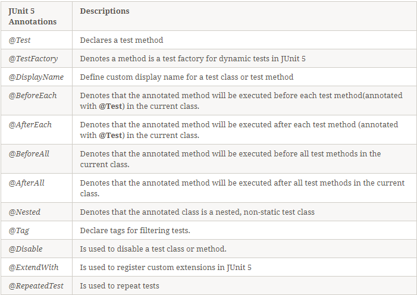

List of Annotations available in JUnit Framework

- BeforeEach, AfterEach: với mỗi phương thức test đều chạy, nghĩa là chạy nhiều lần
- BeforeAll, AfterAll: chỉ chạy một lần, dù có một phương thức hay nhiều phương thức
- Disable: skip test
- Tag: phân loại test