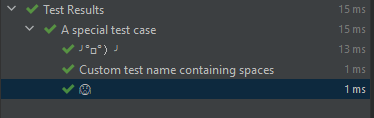

Tìm hiểu một số annotations mà Junit Jupiter hỗ trợ:
- [@Test](#@Test)
- [@ParameterizedTest](#@ParameterizedTest)
- [@RepeatedTest](#@RepeatedTest)
- [@TestFactory](#@TestFactory)
- [@TestInstance](#@TestInstance)
- [@TestTemplate](#@TestTemplate)
- [@DisplayName](#@DisplayName)
- [@BeforeEach](#@BeforeEach)
- [@AfterEach](#@AfterEach)
- [@BeforeAll](#@BeforeAll)
- [@AfterAll](#@AfterAll)
- [@Nested](#@Nested)
- [@Tag](#@Tag)
- [@Disable](#@Disable)
- [@ExtendWith](#@ExtendWith)

***
### @Test
Anontaion này biểu thị method là một test, không cần truyền bất kì tham số gì.
```java
class FirstJUnit5Tests {

    @Test
    void myFirstTest() {
        assertEquals(2, 1 + 1);
    }

}
```

***
### ParameterizedTest
Làm cho một test có thể chạy với nhiều lần với các tham số khác nhau, phải khai báo ít nhất một source cung cấp các argument cho các lần gọi.
```java
@ParameterizedTest
@ValueSource(strings = { "racecar", "radar", "able was I ere I saw elba" })
void palindromes(String candidate) {
    assertTrue(isPalindrome(candidate));
}
```
***
### @RepeatedTest
Dùng để lặp lại test với số lần được chỉ định, dùng với các trường hợp dữ liệu ngẫu nhiên, mỗi lần chạy giống như annotation với @Test. Một số parameter đi cùng như `RepeatitionInfo`, `TestInfo`
```java
    @RepeatedTest(10)
    void repeatedTest() {
            System.out.println("Executing repeated test");
            assertEquals(2, Math.addExact(1, 1), "1 + 1 should equal 2");
    }
```
***
### @DisplayName
Thay đổi tên của test class hoặc method với khoảng trắng, kí tự đặc biệt, thậm chí emojis
```java
@DisplayName("A special test case")
public class DisplayDemo {
    @Test
    @DisplayName("Custom test name containing spaces")
    void testWithDisplayNameContainingSpaces() {
    }

    @Test
    @DisplayName("╯°□°）╯")
    void testWithDisplayNameContainingSpecialCharacters() {
    }

    @Test
    @DisplayName("😱")
    void testWithDisplayNameContainingEmoji() {
    }
}
```
Kết quả:


***
### @BeforeEach
Method sẽ được thực thi trước mỗi @Test, RepeatedTest, với mỗi đối số của @ParameterizedTest hoặc @TestFactory
Ở [bài 2](../2-basic-template) đã mô tả
***
### @AfterEach
Ở [bài 2](../2-basic-template) đã mô tả
***
### @BeforeAll
Ở [bài 2](../2-basic-template) đã mô tả
***
### @AfterAll
Ở [bài 2](../2-basic-template) đã mô tả
***
### @Nested
Biểu thị lớp được chú thích là lớp kiểm tra lồng nhau, non-static method. @BeforAll và @AfterAll không được sử dụng trực tiếp trong @Nested trừ khi `per-class` test instance lifecycle được sử dụng.

Dùng để test các test có mỗi quan hệ với nhau
```java
@DisplayName("A stack")
class TestingAStackDemo {

    Stack<Object> stack;

    @Test
    @DisplayName("is instantiated with new Stack()")
    void isInstantiatedWithNew() {
        new Stack<>();
    }

    @Nested
    @DisplayName("when new")
    class WhenNew {

        @BeforeEach
        void createNewStack() {
            stack = new Stack<>();
        }

        @Test
        @DisplayName("is empty")
        void isEmpty() {
            assertTrue(stack.isEmpty());
        }

        @Test
        @DisplayName("throws EmptyStackException when popped")
        void throwsExceptionWhenPopped() {
            assertThrows(EmptyStackException.class, () -> stack.pop());
        }

        @Test
        @DisplayName("throws EmptyStackException when peeked")
        void throwsExceptionWhenPeeked() {
            assertThrows(EmptyStackException.class, () -> stack.peek());
        }

        @Nested
        @DisplayName("after pushing an element")
        class AfterPushing {

            String anElement = "an element";

            @BeforeEach
            void pushAnElement() {
                stack.push(anElement);
            }

            @Test
            @DisplayName("it is no longer empty")
            void isNotEmpty() {
                assertFalse(stack.isEmpty());
            }

            @Test
            @DisplayName("returns the element when popped and is empty")
            void returnElementWhenPopped() {
                assertEquals(anElement, stack.pop());
                assertTrue(stack.isEmpty());
            }

            @Test
            @DisplayName("returns the element when peeked but remains not empty")
            void returnElementWhenPeeked() {
                assertEquals(anElement, stack.peek());
                assertFalse(stack.isEmpty());
            }
        }
    }
}
```
***
### @Tag
Dùng để gán nhãn cho việc filter test, có thể khai báo ở lớp hoặc phương thức
```java
@Tag("fast")
@Tag("model")
class TaggingDemo {

    @Test
    @Tag("taxes")
    void testingTaxCalculation() {
    }

}
```
***
### @Disable
Ở [bài 2](../2-basic-template) đã mô tả
***
### @ExtendWith
... 
...
***
### @TestFactory
Là một kiểu dynamic test
```java
public class DynamicTestsDemo {
    // This will result in a JUnitException!
    @TestFactory
    List<String> dynamicTestsWithInvalidReturnType() {
        return Arrays.asList("Hello");
    }

    @TestFactory
    Collection<DynamicTest> dynamicTestsFromCollection() {
        return Arrays.asList(
                dynamicTest("1st dynamic test", () -> assertTrue(true)),
                dynamicTest("2nd dynamic test", () -> assertEquals(4, 2 * 2))
        );
    }

    @TestFactory
    Iterable<DynamicTest> dynamicTestsFromIterable() {
        return Arrays.asList(
                dynamicTest("3rd dynamic test", () -> assertTrue(true)),
                dynamicTest("4th dynamic test", () -> assertEquals(4, 2 * 2))
        );
    }

    @TestFactory
    Iterator<DynamicTest> dynamicTestsFromIterator() {
        return Arrays.asList(
                dynamicTest("5th dynamic test", () -> assertTrue(true)),
                dynamicTest("6th dynamic test", () -> assertEquals(4, 2 * 2))
        ).iterator();
    }

    @TestFactory
    Stream<DynamicTest> dynamicTestsFromStream() {
        return Stream.of("A", "B", "C")
                .map(str -> dynamicTest("test" + str, () -> { /* ... */ }));
    }

    @TestFactory
    Stream<DynamicTest> dynamicTestsFromIntStream() {
        // Generates tests for the first 10 even integers.
        return IntStream.iterate(0, n -> n + 2).limit(10)
                .mapToObj(n -> dynamicTest("test" + n, () -> assertTrue(n % 2 == 0)));
    }

    @TestFactory
    Stream<DynamicTest> generateRandomNumberOfTests() {

        // Generates random positive integers between 0 and 100 until
        // a number evenly divisible by 7 is encountered.
        Iterator<Integer> inputGenerator = new Iterator<Integer>() {

            Random random = new Random();
            int current;

            @Override
            public boolean hasNext() {
                current = random.nextInt(100);
                return current % 7 != 0;
            }

            @Override
            public Integer next() {
                return current;
            }
        };

        // Generates display names like: input:5, input:37, input:85, etc.
        Function<Integer, String> displayNameGenerator = (input) -> "input:" + input;

        // Executes tests based on the current input value.
        ThrowingConsumer<Integer> testExecutor = (input) -> assertTrue(input % 7 != 0);

        // Returns a stream of dynamic tests.
        return DynamicTest.stream(inputGenerator, displayNameGenerator, testExecutor);
    }

    @TestFactory
    Stream<DynamicNode> dynamicTestsWithContainers() {
        return Stream.of("A", "B", "C")
                .map(input -> dynamicContainer("Container " + input, Stream.of(
                        dynamicTest("not null", () -> assertNotNull(input)),
                        dynamicContainer("properties", Stream.of(
                                dynamicTest("length > 0", () -> assertTrue(input.length() > 0)),
                                dynamicTest("not empty", () -> assertFalse(input.isEmpty()))
                        ))
                )));
    }
}
```
***
### @TestInstance
...
***
### @TestTemplate
...