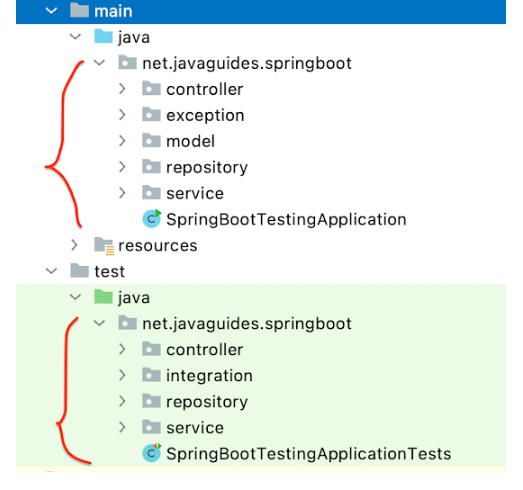
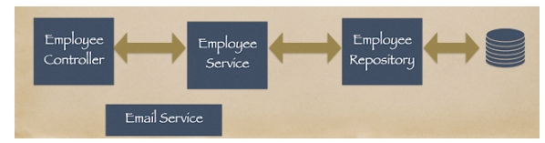

Tổng hợp một số nội dung cơ bản của junit5:

1. [a simple demo with junit5](./1-first-example)
2. [basic annotations in junit5](./2-basic-template)
3. [all annotations in junit5 with example](./3-some-annotations)
4. [assertions](./4-assertions)
5. [nested class](./5-nested-class)
***
## *Chú ý:*
1. Nên chia test độc lập với nhau như kiến trúc code chính:
    
2. Dùng @BeforEach, @AfterEach để set up các điều kiện trước và sau của mỗi test
3. Mặc định JUnit5 không quan tâm đến thứ tự của các test, có thể điều chỉnh bằng @FixMethodOrder
4. Không nên viết nhiều assertion trong một method test nên chia nhỏ nó ra và nhóm các method theo một chức năng bằng một nested class 
5. Không khởi tạo object trong constructor, thay vào đó dùng @BeforeEach
6. Naming Convention: 
   - given/when/then
   - givenEmployeeObject_whenSaveEmployee_thenReturnSavedEmployee
7. Nếu một controller phụ thuộc vào nhiều services dừng một số framework sau để mô phỏng
   - Mockito
   - EasyMock
   - JMockit

    
***
Nếu cảm thấy hữu ích đừng ngần ngại gửi tặng tôi một ngôi sao (star) để tôi có động lực hơn hoàn thành những giáo án chất lượng, cám ơn các bạn rất nhiều.